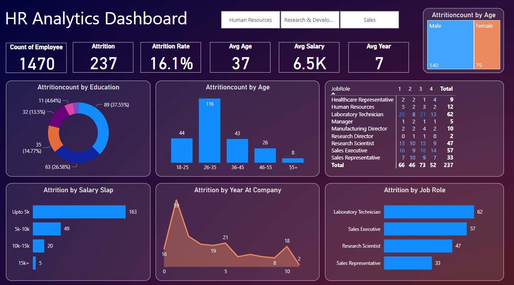

# HR Analytics Dashboard – Power BI Project

## 📊 Project Overview
This project presents an interactive **HR Analytics Dashboard** built using **Power BI**, focusing on key HR metrics such as employee attrition, department-wise distribution, gender breakdown, and salary analysis. The goal is to help HR teams monitor trends and make data-driven decisions regarding workforce planning and retention.

---

## 🛠️ Tools & Technologies Used
- **Power BI Desktop**
- **Power Query** for data cleaning and transformation
- **DAX (Data Analysis Expressions)** for custom KPIs and measures
- **CSV (Raw Dataset)**

---

## 🧹 Data Cleaning (Performed in Power BI)
The raw dataset `HR_Analytics.csv` was cleaned using **Power Query** in Power BI:
- Removed duplicate rows
- Filled or handled missing values
- Standardized column names for readability
- Converted data types (e.g., date, numeric, text)
- Removed invalid or incomplete records
- Filtered out irrelevant columns

> **Note:** The original raw dataset is included in this repository under the `data/` folder.

---

## 📈 Key Insights & Dashboard Features
The dashboard includes the following key metrics and visuals:
- ✅ **Employee Attrition Overview**
- ✅ **Department-wise Employee Count**
- ✅ **Attrition by Gender**
- ✅ **Monthly Income Distribution**
- ✅ **Job Role & Satisfaction Analysis**
- ✅ **Age and Experience Breakdown**
- ✅ **Dynamic filters** to explore attrition by different dimensions (e.g., Gender, Department)

---

## 🖼️ Dashboard Preview

🚀 How to Use
Clone or download this repository.

Open HR_Analytsis_Dashboard.pbix using Power BI Desktop.

Explore the visuals, filters, and key metrics.

Go to Power Query Editor to view all data cleaning steps applied to the raw dataset.

## 👤 Author  
**Devendra Patil**  
Email: devendrapatil8983@gmail.com
